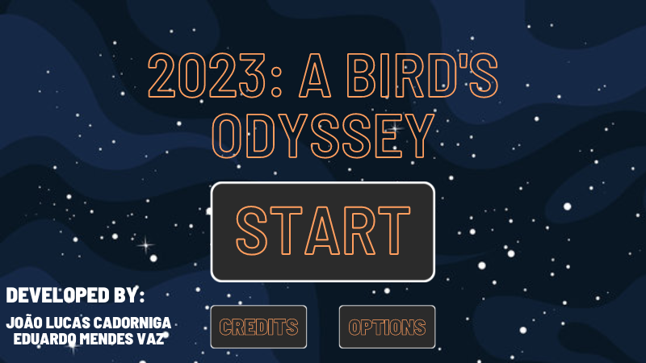

# 2023: A Birds Odyssey
## Game Development and Programming Logic Project, Utilizing Pygame and Linear Algebra Basics.

Developers:

* João Lucas de Moraes Barros Cadorniga [JoaoLucasMBC](https://github.com/JoaoLucasMBC)  
* Eduardo Mendes Vaz [EduardoMVaz](https://github.com/EduardoMVAz)

"2023: A Birds Odyssey" is a python based game development project, made entirely utilizing pygame. Our main focus with this project was honing our skills with both Object-Oriented Programming and Basic Linear Algebra Concepts. With these objectives in mind, our project is strongly Object-Oriented, with a special care for code organization and minimizing repetition.

The goal of the game is launching birds through space and using the gravity of the planets around it to hit a goal in each level. Furthermore, every bird has a special ability that can be very useful to clear the levels.

---

## How to install

Para jogar 2023: A Birds Odyssey, você deve ter Python instalado no seu computador e seguir os passos:

1. Clone o repositório na sua máquina na pasta de sua escolha. Utilize o comando:

`git clone https://github.com/EduardoMVAz/2023_a_birds_odyssey.git`

2. Utilizando o terminal / a IDE de sua escolha, crie uma *Virtual Env* de Python e a ative:

`python -m venv env`

`env/Scripts/Activate.ps1` (Windows)

3. Mude para a pasta do 2023: A Birds Odyssey e instale as bibliotecas requeridas:

`cd ./2023_a_birds_odyssey`

`pip install -r requirements.txt`

4. Após a instalação, rode o arquivo *main.py* pelo terminal para começar o jogo:

`python main.py`

Agora você pode começar a sua aventura! Você deve estar vendo o seguinte menu:

---

## How to play

2023: A Birds Odyssey é dividido em 6 níveis, cada um necessitando de manipulações específicas da gravidade dos planetas para alcançar um objetivo, representado pela cor **AZUL**.

Para utilizar os pássaros disponíveis na fase, o jogador deve utilizar o mouse para mirar a direção do disparo e o módulo da velocidade. O pontilhado na tela indica a direção. Enquanto isso, a distância do mouse do passáro indica a velocidade: quanto mais distante, mais forte o disparo.

Com o pássaro voando pelo espaço, ele poderá ser afetado pela gravidade dos planetas ao entrar em suas órbitas, que são delimitadas visualmente na tela. Utilize a força gravitacional (ou as forças) ao seu favor para manipular a trajetória para o destino. Tome cuidado com os cometas vagando pelo espaço para eles não te impedirem!

Além disso, cada um dos 3 pássaros possui uma habilidade específica que vai te ajudar durante cada fase. Elas são ativadas após o disparo, quando o jogador clicar novamente na tela e só podem ser usadas *UMA VEZ por pássaro*:

* **Basic Bird** - ao clicar, dobra a sua velocidade.

* **Redirect Bird** - ao clicar, redireciona a trajetória do pássaro em direção à direção do mouse do jogador

* **Gun Bird** - ao clicar, atira um projétil na direção do mouse do jogador que pode destruir obstáculos para abrir o caminho

Por fim, o número de pássaros em cada nível é limitado. Caso eles terminem, você pode tentar novamente ou desistir (covarde!). **Have fun!**

---

## Physical Model

O modelo físico de 2023: A Birds Odyssey é formado a partir do uso de vetores. Cada instância de objeto, seja um pássaro ou corpo celestial, possui vetores de posição, velocidade e aceleração, seguindo as seguintes regras:

* Cada objeto possui um vetor [x, y] de posição com as coordenadas na tela, um vetor [Vx, Vy] de velocidades (mesmo que para corpos estáticos sempre se mantenha nulo) e de aceleração [Ax, Ay], determinados na criação do objeto.

* As posições e velocidades (vetores) são, portanto, atualizadas da seguinte maneira:

$S_n = S_{n-1} + V_n * k$

$V_n = V_{n-1} + A_n$

*obs: $k$ é uma constante de regulagem utilizada quando necessário para ajuste do incremento da velocidade.*

* No momento do disparo, o vetor de velocidade do pássaro é recalculado da seguinte maneira:

`d = pygame.mouse.get_pos() - self.pos`

`self.vel = d/120`

1. d é o vetor calculado pela subtração entre o vetor de posição do mouse e do `self.pos`, a posição do pássaro. Assim, temos a direção do disparo.

2. Então, ao multiplicar o vetor por $\frac{1}{120}$, regulamos a intensidade da velocidade. O vetor não é normalizado para que a distância do mouse até o pássaro tenha influência ativa no lançamento: quanto mais distante, mais "forte" ele será. 

Assim, ele passa a percorrer um movimento uniforme no espaço.

* Ao colidir com a órbita de um planeta, o pássaro começa a sofrer efeito de uma aceleração da gravidade calculada pela fórmula:

`d = celestial_body.pos - self.birds[self.current_bird].pos`

`d1 = d/np.linalg.norm(d)`

`self.birds[self.current_bird].acc = d1 * celestial_body.gravity.gravity/np.linalg.norm(d)**2`

1. d é o vetor calculado pela subtração entre o vetor de posição do mouse e da posição do corpo celeste que atrai o pássaro. Assim, temos a direção da atração da gravidade.

2. O vetor é então normalizado, ao dividirmos ele por sua norma.

3. Por fim, a aceleração do pássaro em movimento é definida pela multiplicação do vetor calculado anteriormente pelo escalar calculado pelo quociente da constante gravitacional do objeto pelo quadrado da distância entre o pássaro e o corpo.

Portanto, enquanto em órbita, percorre movimento uniformemente variado. A constante `gravity` é fornecida na instanciação do objeto, e regula a intensidade da força gravitacional para cada nível ser o mais equilibrado possível.

* Ao sair de órbita, o pássaro perde sua aceleração e então volta a percorrer movimento uniforme no espaço de acordo com a velocidade de quando escapou pela tangente.

### Alterations on the Model

Cada um dos pássaros realiza alterações na física dos objetos e entidades do jogo:

1. **Basic Bird**  - ao usar a sua habilidade, dobra a sua velocidade. Seu vetor, portanto, é multiplicado pelo escalar 2.

2. **Redirect Bird** - ao usar a sua habilidade, refaz o cálculo de disparo utilizando a mesma fórmula anterior.

3. **Gun Bird** - ao usar a sua habilidade, instancia um objeto de bala, que possui posição inicial igual a do pássaro, e sua velocidade é calculada pela mesma fórmula das outras velocidades, sempre em relação a posição do mouse do jogador. No entanto, sua velocidade é constante, portanto, o vetor é normalizado antes de ser aplicado ao tiro.

Assim, as habilidades dos pássaros agem como **novas formas de interagir com o jogo, sendo novos elementos com comportamentos diferentes** do habitual, alterando o modelo físico.
